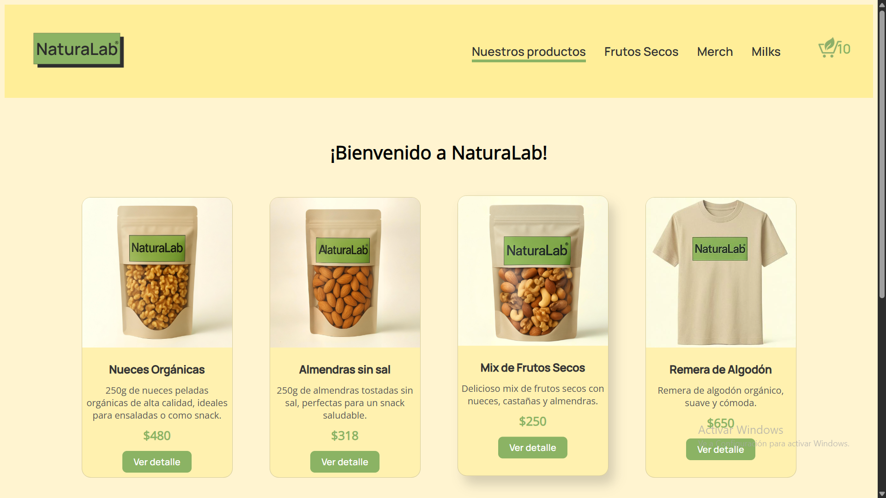

# 🌱 NaturaLab - Tienda Online de Productos Naturales

**Autor:** Gabriel Rodriguez  
**Curso:** React JS - Coderhouse  
**Entrega Final**  
**Demo:** [https://naturalab.vercel.app/](https://naturalab.vercel.app/)

---

## 🛒 Descripción

**NaturaLab** es una tienda online ficticia dedicada a la venta de productos naturales, frutos secos y merchandising ecológico. El objetivo de este proyecto es aplicar todos los conocimientos adquiridos en el curso de React JS de Coderhouse, desarrollando una aplicación web moderna, escalable y con una experiencia de usuario atractiva.

---

## 🚀 Tecnologías Utilizadas

- **React 19**  
  Biblioteca principal para la construcción de interfaces de usuario basadas en componentes reutilizables.

- **Vite**  
  Herramienta de desarrollo ultrarrápida para proyectos modernos de frontend.

- **React Router DOM**  
  Manejo de rutas y navegación SPA (Single Page Application).

- **Firebase (Firestore)**  
  Base de datos en tiempo real para almacenar y consultar productos y órdenes de compra.

- **SweetAlert2**  
  Librería para mostrar alertas y notificaciones personalizadas y atractivas.

- **CSS personalizado**  
  Estilos propios para una identidad visual única, incluyendo fuentes personalizadas.

---

## 🖥️ Funcionalidades Principales

- **Catálogo de productos**: Visualiza todos los productos disponibles, filtrados por categorías.
- **Detalle de producto**: Consulta información detallada de cada producto, incluyendo imagen, descripción, precio y stock.
- **Carrito de compras**: Añade productos al carrito, modifica cantidades y elimina ítems.
- **Checkout**: Completa el formulario de compra y visualiza el resumen de tu pedido.
- **Persistencia de datos**: Los productos y las órdenes se gestionan a través de Firebase Firestore.
- **Alertas y feedback**: Notificaciones visuales para acciones importantes (agregar al carrito, errores de stock, etc).
- **Navegación amigable**: SPA con rutas protegidas y manejo de páginas no encontradas.

---

## 📸 Capturas



---

## 🛠️ Instalación y Uso

1. **Clona el repositorio:**

   ```bash
   git clone https://github.com/tu-usuario/tu-repo.git
   cd tu-repo
   ```

2. **Instala las dependencias:**

   ```bash
   npm install
   ```

3. **Inicia el servidor de desarrollo:**

   ```bash
   npm run dev
   ```

4. **Accede a la app:**  
   Abre [http://localhost:5173](http://localhost:5173) en tu navegador.

---

## 📚 Estructura del Proyecto

```
src/
  App.jsx
  main.jsx
  index.css
  assets/
  components/
    NavBar/
    Item/
    ItemDetail/
    ItemList/
    ItemListContainer/
    Checkout/
    NotFound/
    utils/
```

---

## 🎯 Objetivo del Proyecto

El propósito de **NaturaLab** es demostrar el dominio de React JS, incluyendo:

- Componentización y reutilización de código.
- Manejo de estado y contexto global (Context API).
- Integración con servicios externos (Firebase).
- Navegación avanzada con React Router.
- Buenas prácticas de desarrollo frontend.

---

## 👨‍💻 Autor

Gabriel Rodriguez  
[LinkedIn](https://www.linkedin.com/in/rodriguez-gabriel-fullstackdeveloper/)  
Proyecto realizado para la cursada de **React JS** en [Coderhouse](https://www.coderhouse.com/uy/cursos/reactjs).

---

> ¡Gracias por visitar el proyecto!  
> Si tienes sugerencias o encuentras algún bug, no dudes en abrir un issue o contactar al autor.
